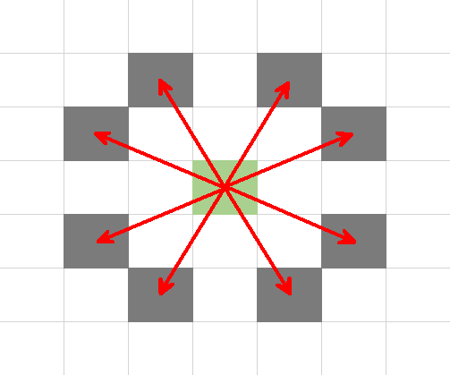

# **Time Limit: 0.2s    Memory Limit: 32M**
# **Description**
Please calculate the minimum number of moves needed for a knight to reach one point from another on a n*n chessboard.   

   

# **Input**
The first line is an integer n, representing a n*n chess board. (1≤n≤300) The next two lines each contain two integers x and y, representing the start position and the end position. (0≤x,y≤n−1) 

# **Output**
An integer representing the minimum number of moves. 

# **Sample Input**
100 
0 0 
30 50  

# **Sample Output**  
28   